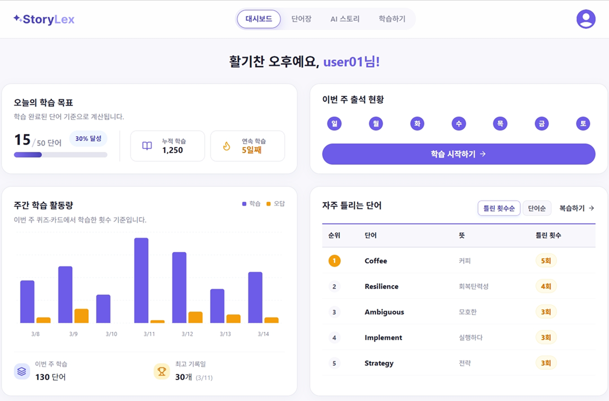

# StoryLex Frontend
오답 기반 학습 흐름(오답 노트 → 재학습 → 스토리 생성)을 중심으로 한 React 웹 애플리케이션입니다.
핵심 포인트는 인증 만료(401) 시 동시 요청을 안전하게 처리하는 네트워크 레이어와, Mock/MSW를 통한 개발 검증 흐름입니다.

## 1. 프로젝트 범위
- 프론트엔드 루트: `project-app`
- 라우팅: 인증/대시보드/단어/학습/스토리 페이지 제공
- 주요 구현: 대시보드 시각화, 오답 테이블/정렬, 단어 상세(연관 단어), 인증/토큰 갱신

## 2. 검증된 기술 스택 (실제 코드 기준)
`project-app/package.json` 기준

- React: `^19.2.0`
- React DOM: `^19.2.0`
- React Router DOM: `^7.9.6`
- TanStack React Query: `^5.90.12`
- Zustand: `^5.0.9`
- Recharts: `^3.5.1`
- Axios: `^1.13.2`
- MSW(devDependency): `^2.12.9`
- Vite: `^7.2.4`

참고
- TypeScript 런타임 사용 없음 (`src` 내 `.ts/.tsx` 파일 없음, JS/JSX 기반)
- `@types/react`는 devDependency로만 포함

## 3. 빠른 시작
```bash
cd project-app
npm ci
npm run dev
```

빌드/프리뷰
```bash
npm run build
npm run preview
```

## 4. 환경 변수
주요 env는 `project-app/.env.development`, `project-app/.env.local`에서 관리합니다.

- `VITE_API_BASE_URL`
  - API 기본 URL (기본: `http://localhost:8080`)
- `VITE_USE_MOCK`
  - `true`: API 모듈에서 네트워크 호출 없이 mock 즉시 반환
  - `false`: 실제 네트워크 경유
- `VITE_ENABLE_MSW`
  - `true`: dev 환경에서 MSW worker를 시작하여 네트워크를 가로챔
- `VITE_MSW_PROOF`
  - `true`: MSW proof 시나리오용 로깅/미처리 요청 경고 모드
- `VITE_MSW_REDIRECT`
  - proof 모드에서 로그인 리다이렉트 허용 여부
- `VITE_WORD_DETAIL_MOCK_PANEL`
  - 단어 상세에서 개발용 mock case 패널 표시 여부

중요
- `VITE_USE_MOCK=true`면 대부분 API가 네트워크를 타지 않으므로 MSW 검증 시나리오를 보기 어렵습니다.
- MSW로 인증 흐름을 검증하려면 보통 `VITE_USE_MOCK=false`, `VITE_ENABLE_MSW=true` 조합을 사용합니다.

## 5. 라우트 개요
`src/router.jsx` 기준

- 공개 라우트
  - `/` 랜딩
  - `/auth/login`, `/auth/signup`, `/auth/setup`, `/auth/find`
- 보호 라우트 (`ProtectedRoute`)
  - `/dashboard`
  - `/words`, `/words/:id`
  - `/learning`, `/learning/quiz`, `/learning/card`, `/learning/wrong-notes`
  - `/stories`, `/stories/:id`, `/stories/create`
  - `/account/profile`

## 6. 아키텍처
### 6.1 Server State: React Query
- 앱 루트에서 `QueryClientProvider` 주입
- 주요 페이지에서 `useQuery` 기반 조회, 일부 페이지는 `useMutation`으로 optimistic update 수행
- 사용 예
  - 대시보드: 일일 목표/통계/주간/오답 Top5
  - 단어 목록: 목록 조회 + 즐겨찾기 토글 mutation
  - 오답노트: 목록 조회 및 탭/정렬/페이지 처리

### 6.2 Client State: Zustand + Context
- `useAuthStore`: 사용자/로그인 상태 저장
- `useLearningSettingsStore`: 학습 옵션(문항 수, 난이도, 분야)
- `AuthContext`: 로그인/로그아웃/세션 복원 흐름을 감싸고 Zustand와 동기화

### 6.3 Network Layer: Axios Interceptor
- `src/api/httpClient.js`에서 요청/응답 인터셉터 통합 관리
- 액세스 토큰 자동 부착
- 401 처리 시 refresh 단일 비행(single-flight) + 대기열(queue) 처리

## 7. 인증 동시성 제어 (401 Queue 패턴)
구현 위치: `src/api/httpClient.js`

핵심 로직
1. 요청이 401이면 refresh 대상인지 판단
2. 이미 refresh 진행 중이면 현재 요청을 queue(`refreshSubscribers`)에 적재
3. refresh 성공 시 대기 요청을 새 토큰으로 재시도
4. refresh 실패 시 queue 요청 모두 reject하고 세션 정리

주요 변수/함수
- `isRefreshing`, `refreshSubscribers`
- `subscribeTokenRefresh`, `notifyRefreshed`, `notifyRefreshFailed`
- `redirectToLogin`, `_retry` 플래그

효과
- 동시 다발 401에서도 refresh 요청을 1회로 제한
- pending 누수/무한 재시도 방지

## 8. MSW 기반 인증 예외 시나리오
MSW 구성 파일
- `src/mocks/browser.js`
- `src/mocks/handlers.js`
- `public/mockServiceWorker.js`

핸들러 특징
- `/api/auth/login`에서 만료 access 토큰을 내려 401 상황을 의도적으로 유도
- `/api/auth/refresh` 성공 시 valid access로 전환
- `/api/user/me`, `/api/dashboard/summary`, `/api/words/today` 등 보호 API는 토큰 검증

개발용 proof helper
- `src/dev/refreshProof.js` (main에서 import)
- 콘솔에서 동시 요청 proof 실행 가능

예시
- `__seedRefreshProofTokens(); __runRefreshProof();`
- 기대 흐름: `401 xN -> /api/auth/refresh x1 -> 200 xN`

## 9. 대시보드 구현 요약
구현 파일: `src/pages/dashboard/DashboardPage.jsx`

조회 쿼리
- `getDailyGoal`
- `getDashboardStats`
- `getWeeklyStudy`
- `getWrongTop5`

시각화
- Recharts `BarChart`
- 시각화 데이터: `date`, `learned`, `wrong` (주간 학습/오답 수)

테이블
- 섹션: 자주 틀리는 단어
- 컬럼: 순위 | 단어 | 뜻 | 틀린 횟수
- 정렬: `틀린 횟수순` / `단어순`
- 구현: `wrongWordsSortBy + useMemo(sortedWrongWords)`
- 반응형: 모바일에서 `뜻` 컬럼 숨김

## 10. 단어 상세(Word Detail) 목업/연관 단어
구현 파일
- `src/pages/words/WordDetailPage.jsx`
- `src/mocks/wordDetailMockCases.js`
- `src/api/wordClusterApi.js`

특징
- 연관 단어 탭(전체/유의어/반의어)
- mock case 패널로 대표 시나리오 빠른 전환 가능 (환경변수 토글)
- 연관 단어 chip UI는 현재 단일 색상 스타일로 통일

## 11. API 모듈 구성
`src/api/*`

대표 모듈
- `authApi`: 로그인/회원가입/중복확인/유저조회
- `dashboardApi`: 대시보드 요약/주간/오답 Top5
- `wordApi`, `wordClusterApi`, `wrongApi`, `studyApi`
- `quizApi`, `cardApi`, `storyApi`, `aiStoryApi`, `userApi`

공통 특징
- `VITE_USE_MOCK` 분기 지원
- 일부 모듈은 응답 normalize로 필드명 편차 방어

## 12. 디렉터리 구조
```text
project-app/
  src/
    api/
    assets/
    components/
      common/
      layout/
    context/
    dev/
    mocks/
    pages/
      account/
      auth/
      dashboard/
      home/
      learning/
      stories/
      words/
    store/
    styles/
    utils/
```

## 13. 스크린샷
### Dashboard


### Wrong Note


### Learning


## 14. 한계 및 참고
- 자동화 테스트 파일(`*.test.*`, `*.spec.*`)은 현재 `src`에 없음
- 루트 `src/hooks` 디렉터리는 없고, 페이지 단위 `pages/*/hooks` 패턴 사용
- 코드베이스는 JS/JSX 중심. TypeScript 전환 계획이 있으면 별도 `tsconfig`와 점진적 마이그레이션 필요
